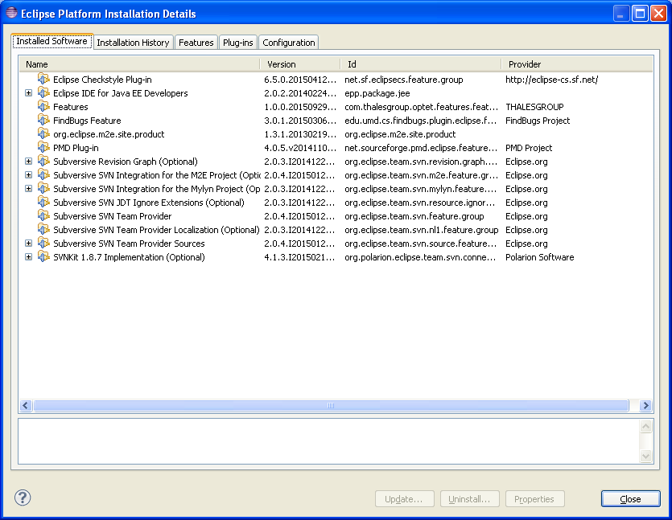

FIWARE Policy Manager - Installation and Administration Guide
_____________________________________________________________

Policy Manager Installation
===========================

This guide tries to define the procedure to install the Trustworthy Factory
in a machine, including its requirements and possible troubleshooting
that we could find during the installation.

Requirements
------------

The pre-requisite for the java factory is a Windows OS  and a JDK1.7. The JAVA_HOME and the PATH must be set up according to the JDK installation directory.

Installation
============

Two possible installation procedures could be used to have the Trustworthy Factory ready to use

The Zip installation
--------------------

The simplest solution is to take the Zip installation provided to extract the complete factory already configured for the development of Java application. For that, recover the Zip archive and unzip it.
The factory is ready to use.

The Eclipse update
------------------

This installation is based on a virgin eclipse installation where all the plugins must be deployed. For that, an Kepler eclipse version must be used.
The process is to use the update site of all the plugins in order to build the java factory.
In eclipse HMI, the software installation view must be opened : Help>Install new software

The installation of a new plugin is realised by following the 3 steps:

- For each plugin, one must create a new update site entry using the “Add” button and fulfill the required information:
- The name of the update site
- The URL of the update site
 
# For the selected update site, we must select the package to install. Depending on  the installed plugin, a selection of features is displayed. The user must select the features of the plugin required for the installation. In the Trustworthy Factory context, the selection required is described later for each plugin.
# After the selection, the usage licence must be accepted in order to complete the installation.
In the Trustworthy Factory case, the following plugin must be installed:
:: 	
    +-------------------+---------------------------------------------------------------------------------------+-------------------+
    | Tool              | Update site                                                                           | Selection         |
    +-------------------+---------------------------------------------------------------------------------------+-------------------+
    | checkstyle        | http://eclipse-cs.sf.net/update/                                                      | All               |
    +-------------------+---------------------------------------------------------------------------------------+-------------------+
    | PMD               | http://sourceforge.net/projects/pmd/files/pmd-eclipse/update-site/                    | PMD for eclipse 4 |
    +-------------------+---------------------------------------------------------------------------------------+-------------------+
    | findbugs          | http://findbugs.cs.umd.edu/eclipse                                                    | All               |
    +-------------------+---------------------------------------------------------------------------------------+-------------------+
    | codepro           | http://dl.google.com/eclipse/inst/codepro/latest/3.7                                  | All               |
    +-------------------+---------------------------------------------------------------------------------------+-------------------+
    | Subversive        | http://download.eclipse.org/technology/subversive/2.0/update-site/                    | All               |
    +-------------------+---------------------------------------------------------------------------------------+-------------------+
    | Subversive        | http://community.polarion.com/projects/subversive/download/eclipse/4.0/update-site/   | SVNKIT 1.8.4      |
    +-------------------+---------------------------------------------------------------------------------------+-------------------+
    | maven             | http://download.eclipse.org/technology/m2e/releases/1.3/1.3.1.20130219-1424           | All               |       
    +-------------------+---------------------------------------------------------------------------------------+-------------------+
    | Eclemma           | http://update.eclemma.org/                                                            | All                   |
    +-------------------+---------------------------------------------------------------------------------------+-------------------+

Then, the Trustworthy Factory update site must be installed to complete the installation. The installation is realised using the zip file of the trustworthy factory.

At the end of the installation procedure, the eclipse.ini file must be modified. The line -product org.eclipse.platform.ide must be added/replaced in this file.
The eclipse platform must be restarted at the end of the installation in order to activate all the options.

Diagnosis Procedures
====================

The factory is based on Eclipse which provides error managements and diagnostic element. The factory follows this philosophy providing :

- Error Dialogs: The factory displays messages using message dialogues to display information to the user (errors or informations)
- Log information: the factory has a log file where problems are recorded. The log file can be found in a couple of places:
	- Workspace log - This is the most common location for the log file, It is stored in your workspace in the meta-data directory. Check out workspace/.metadata/.log.
	- Configuration log - Sometimes information is record in the configuration log file instead of the workspace log. (especially if the workspace hasn't been created yet, there isn't one, or it cannot be created) Check your configuration area for a configuration log file. (configuration/<timestamp>.log)
- Console errors: Occasionally problems happen in the system really early before there is a workspace and before there is a configuration area. This means that there is nowhere to write the log file so information is written to the console. For that launch the factory using the eclipsec.exe executable instead of eclipse.exe.

Sanity check procedures
=======================

The Sanity Check Procedures are the steps that a System Administrator
will take to verify that an installation is ready to be tested. This is
therefore a preliminary set of tests to ensure that obvious or basic
malfunctioning is fixed before proceeding to unit tests, integration
tests and user validation.

End to End testing
------------------
In the case of the Optet plugins, the different elements are signed in order to keep the consistency of the different elements, especially the configuration elements.

1. Installation inspection 
Le following plug-ins list must be check to in the factory to check the completude of the installation. For that, in the "About eclipse platform", check is the folowing mandatory plug-ins are present:

2. Configuration consistency check tool
The consistency check is based on the verification of the signature of the different plugins. In order to check the signature, he can use the jarsigner process provided by the JDK. A specific preference page is provided into the Optet configuration to configure the path of this jarsigner.
 

3. Run the consistency check
In the Optet Presentation page, a button called “check consistency” can be used to check the consistence of the eclipse installation. The check realised is the signature verification of all the signed plugins present into the eclipse installation directory.
If the consistency is Ok, the following message appears:

  
Otherwise, the error message will be displayed.

List of Running Processes
-------------------------
Using the windows Task Manager, check that an "eclipse" process in runing

Network interfaces Up & Open
----------------------------
The eclipse platform must be configure to access internet in order to install plugins and run compilation. For that, use the `eclipse tutorial <http://help.eclipse.org/luna/index.jsp?topic=%2Forg.eclipse.platform.doc.user%2Freference%2Fref-net-preferences.htm>`__ in order to configure the internet access 

Databases
---------
No Database
    

Diagnosis Procedures
====================

The Diagnosis Procedures are the first steps that a System Administrator
will take to locate the source of an error in a GE. Once the nature of
the error is identified with these tests, the system admin will very
often have to resort to more concrete and specific testing to pinpoint
the exact point of error and a possible solution. Such specific testing
is out of the scope of this section.

Resource availability
---------------------

The resource availability in the node should be at least 4Gb of RAM and
8GB of Hard disk in order to prevent enabler’s bad performance in both
nodes. This means that bellow these thresholds the enabler is likely to
experience problems or bad performance.

Remote Service Access
---------------------

This GE can't be access remotly.

Resource consumption
--------------------
The factory is vbased on eclipse which is well know to have a bad memory management. The memory consumption can vary from 250M to 1G Ram.
The CPU consuption is depending of the usage (édition, compilation, code generation, execution, etc...)

I/O flows
---------

Input flow
No input flow must arrived to the factory

output flows
The factory uses internet connection in order to access plugin repository and libraries repository. The required port are 80 and 443. Following the user usage, some specific repository must be access and the port is dependant of the repository specification
